# 🏡 SenseState

**SenseState** is an intelligent real estate search platform for Vietnamese property listings. It combines automated web crawling, AI-powered query understanding, and vector similarity search to let users find properties through natural language queries.

🌐 **Live demo:** [sensestate.vercel.app](https://sensestate.vercel.app)

---

## ✨ Features

- 🔍 **Natural language search** — ask in plain Vietnamese or English (e.g. *"căn hộ 2 phòng ngủ quận 7 dưới 3 tỷ"*)
- 🤖 **LLM-powered query parsing** — GPT extracts price, area, address, and intent from your query
- 🧲 **Semantic similarity** — OpenAI embeddings rank properties by relevance
- 🗂️ **Hybrid filtering** — combine semantic search with exact/range filters on price and area
- 🕷️ **Automated crawling pipeline** — scrape, preprocess, embed, and load data end-to-end
- 📱 **Responsive UI** — Bootstrap 5 frontend deployed on Vercel

---

## 🕷️ Crawling Pipeline

The data pipeline runs in four sequential stages to bring property listings from [batdongsan.com.vn](https://batdongsan.com.vn) into the vector database:

```mermaid
flowchart LR
    A[🌐 batdongsan.com.vn] -->|Selenium\nundetected-chromedriver| B(CrawlStep\nCollect raw listings)
    B -->|title · address\nprice · area\nimages · description| C(PreprocessStep\nNormalize & clean data)
    C -->|structured\nData objects| D(EmbeddingStep\nOpenAI text-embedding-3-small)
    D -->|1536-dim\nvectors| E(DatabaseLoadStep\nUpsert to Qdrant)
    E -->|indexed\ncollection| F[🔎 Search API\n/api/properties]

    style A fill:#f0f4ff,stroke:#4a6cf7
    style B fill:#fff7e6,stroke:#f59e0b
    style C fill:#f0fdf4,stroke:#22c55e
    style D fill:#fdf4ff,stroke:#a855f7
    style E fill:#fff1f2,stroke:#f43f5e
    style F fill:#f0f4ff,stroke:#4a6cf7
```



| Stage | Tool | What it does |
|---|---|---|
| **Crawl** | Selenium + undetected-chromedriver | Bypasses anti-bot detection, paginates listings, skips already-seen URLs |
| **Preprocess** | Python | Normalizes price units (tỷ / triệu / triệu/tháng), parses area, cleans text |
| **Embed** | OpenAI `text-embedding-3-small` | Converts property descriptions into 1536-dim vectors (batched, 5 per call) |
| **Load** | Qdrant | Upserts vectors + metadata payload; creates indexes on price, area, address, url |

Run the pipeline from the command line:

```bash
python -m pipeline.entry --url https://batdongsan.com.vn/ban-can-ho-chung-cu --max-items 50
```

---

## 🛠️ Tech Stack

| Layer | Technology |
|---|---|
| **API** | FastAPI + Uvicorn |
| **Web Scraping** | Selenium, undetected-chromedriver |
| **Embeddings / LLM** | OpenAI (`text-embedding-3-small`, `gpt-4o-mini`) |
| **Vector DB** | Qdrant |
| **Frontend** | HTML5, Bootstrap 5, Vanilla JS |
| **Deployment** | Vercel (frontend) |

---

## 🚀 Getting Started

### Prerequisites

- Python 3.10+
- Chrome browser
- A running [Qdrant](https://qdrant.tech/) instance (local Docker or Qdrant Cloud)
- OpenAI API key

### Installation

```bash
git clone https://github.com/phnguyen26/sensestate.git
cd sensestate
pip install -r requirements.txt
```

### Environment Variables

Create a `.env` file in the project root:

```env
OPENAI_API_KEY=sk-...
QDRANT_URL=http://localhost:6333
QDRANT_API_KEY=           # leave empty for local instances
```

### Start the API server

```bash
uvicorn main:app --reload
```

The API will be available at `http://localhost:8000`.

---

## 📡 API Reference

### `GET /api/properties`

Intelligent hybrid search using natural language.

| Parameter | Type | Default | Description |
|---|---|---|---|
| `s` | string | **required** | Natural language query |
| `page` | int | `1` | Page number |
| `limit` | int | `9` | Results per page (max 50) |

**Example:**
```
GET /api/properties?s=chung cư quận 1 dưới 5 tỷ
```

### `GET /api/data`

Browse all properties (paginated, no search filter).

| Parameter | Type | Default | Description |
|---|---|---|---|
| `page` | int | `1` | Page number |
| `limit` | int | `9` | Results per page (max 50) |

### `GET /api/properties/{property_id}`

Fetch a single property by its integer ID.

---

## 📁 Project Structure

```
sensestate/
├── main.py                   # FastAPI app entry point
├── requirements.txt
├── config/
│   └── qdrant_config.py      # Qdrant connection & collection setup
├── pipeline/
│   ├── pipeline.py           # CrawlStep → PreprocessStep → EmbeddingStep → DatabaseLoadStep
│   └── entry.py              # CLI entry point for the pipeline
├── routers/
│   └── api.py                # API route handlers
├── utils/
│   ├── data_crawler.py       # Selenium-based scraper
│   ├── preprocessing.py      # Data cleaning & normalization
│   └── check_existed_url.py  # URL deduplication against Qdrant
└── frontend/                 # Static web UI (served by FastAPI)
    ├── index.html
    ├── js/
    └── css/
```

---

## 📄 License

This project is open source. Feel free to use, modify, and distribute it.
